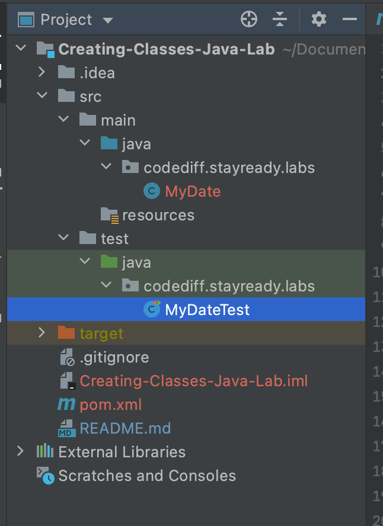
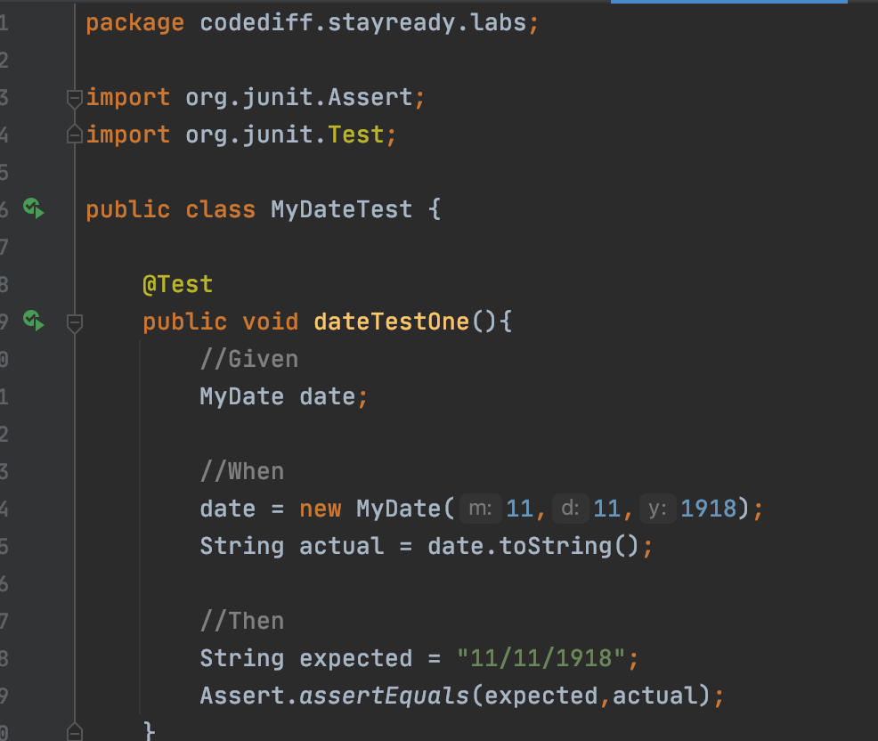

# Creating Classes Java Lab

In this lab you will build a Java class composed of constructor, attributes, and methods as well as learn how to test your source code.

## Step 1: Create a MyDate class

In this step, you create a MyDate type. The Date type already exists in Java (see java.util.Date and java.util.Calendar). However, you create another much simpler date type called MyDate to demonstrate object-orientated programming (OOP) concepts. You will modify MyDate later to demonstrate more advanced OOP concepts.

  1. Make a `Java Project` to store your new classes and code. You can refer to the Hello World Lab for guidance creating a project.
  1. Create a class called MyDate. You can refer to the Hello World Lab for guidance creating a class.
  1. Add day, month, and year attributes to MyDate. These three attributes (member variables) should be of type int.

## Step 2: Create two constructors

Constructors allow you to initialize an object when it is created (instantiated). You are required to add two constructors to the MyDate class.

  1. Add a no-argument (no-args) constructor. The no-args constructor enables you to make a MyDate using default values.
  1. Add a constructor that has three integer arguments (parameters). This will enable the user to create a MyDate using a constructor like this: new MyDate(2, 6, 2004)
  1. Save your file, and fix any compiler errors before moving to the next step.

## Step 3: Add some methods to MyDate

The MyDate class you have created needs two methods. Recall that a method represents an action or something an object can do. Users of MyDate should be able to see the dates represented by the object. Therefore, you must provide a method, called `toString()`, that turns the MyDate object into a String. Users of MyDate should also be able to reset the date represented by MyDate by feeding in three parameters, so you must create a `setDate()` method.

  1. In the MyDate class, add a `toString()` method. The method should return a String that contains the values of day, month, and year.
  1. Create a setDate(m, d, y) method. `The setDate()` method enables the user to call one method to set day, month, and year of a MyDate object.

## Step 4: Run MyDateTest

A program is provided to test your new class. You don’t need to write this program, as it is available as part of the lab.

1. Find the file `MyDateTest.java` in the project explorer tab and open the file

    

1. Verify there are no errors in the `MyDateTest.java` file. An error will appear as a red squiggle (similair to a misspelling in MS Word) and will prevent to tests from running. Any errors in `MyDateTest.java` are the result of a mistake in `MyDate.java`. You should not have to change `MyDateTest.java`.

1. In the `MyDataTest.java` file, find the green arrow that is next to the `public class MyDateTest`. Clicking this will run the test cases.

    

1. Check the terminal for the results. If any of the test cases fail than now is the time to debug your source code. Below are some hints on where to look if a specific test fails:
    - Test 1: Check out your constructor with three inputs
    - Test 2: Check out your member variables (attributes)
    - Test 3: Check out your `setDate()` method 
    - All Fail: Check out your `toString()` method

1. Everytime you change your source code i.e. `DateTest.java` you should rerun your test cases to see if your test results changed. If more tests fail, undo the change. If more pass, you successfully fixed a bug!

## Step 5: Submission

Commit and push all your changes to your repository
